# Systems One MQTT Service

A .NET 8 Worker Service that monitors system health, application state, and database throughput on manufacturing workstations — publishing everything to an MQTT broker for centralized visibility.

---

## System Overview

```mermaid
flowchart TB
    subgraph Service["Systems One MQTT Service (.NET 8 Worker)"]
        direction TB

        subgraph Workers["Background Workers"]
            MW["<b>MonitoringWorker</b><br/>Every 5 minutes<br/><i>Runs all collectors</i>"]
            ARW["<b>AppRealtimeWorker</b><br/>Every 2 seconds<br/><i>App collectors only</i>"]
        end

        subgraph Interfaces["Core Interfaces"]
            IMC["<b>IMetricCollector</b><br/>Name · Category · CollectAsync()"]
            IMP["<b>IMetricPublisher</b><br/>Connect · Publish · Disconnect"]
            ISched["<b>IScheduler</b><br/>Clock-aligned intervals"]
            IClock["<b>IClock</b><br/>Testable time source"]
        end

        subgraph OS_Cat["OS Collectors"]
            OSV["OsVersionCollector<br/><code>os.version</code>"]
            OSU["OsUptimeCollector<br/><code>os.uptime</code>"]
            CPU["CpuUsageCollector<br/><code>cpu.usage</code>"]
            MEM["MemoryUsageCollector<br/><code>memory.*</code>"]
            DSK["DiskFreeCollector<br/><code>os.drives</code>"]
            TMP["TemperatureCollector<br/><code>system.temperature.*</code>"]
        end

        subgraph App_Cat["App Collectors"]
            APP["AppCollector<br/><code>app.running</code><br/><code>app.settings.*</code>"]
        end

        subgraph DB_Cat["DB Collectors"]
            DBC["DatabaseCollector<br/><code>db.connection</code><br/><code>db.itemlog.summary</code>"]
        end

        subgraph Pub["MQTT Publisher"]
            MQTT["<b>MqttMetricPublisher</b><br/>Auto-reconnect · QoS 1<br/>Metric buffer (1000 max)<br/>LWT offline detection"]
        end

        subgraph Infra["Infrastructure"]
            SC["SystemClock"]
            IS["IntervalScheduler<br/><i>Clock-boundary aligned</i>"]
            MHC["MqttHealthCheck"]
            DHC["DatabaseHealthCheck"]
            SL["SerilogStartup<br/><i>Console + JSON file</i>"]
        end
    end

    subgraph External["External Systems"]
        BROKER[("MQTT Broker<br/><i>Mosquitto etc.</i>")]
        SQLDB[("SQL Server<br/><i>Systems_One DB</i>")]
        SYSONE["Sys_One_Static_App.exe<br/><i>Monitored application</i>"]
        SETTINGS["Settings JSON Files<br/><i>App configuration</i>"]
        WMI["WMI / sysfs<br/><i>Thermal sensors</i>"]
        PERFCTR["Performance Counters<br/><i>CPU · Memory</i>"]
    end

    subgraph Consumers["Downstream Consumers"]
        DASH["Monitoring Dashboard<br/><i>Grafana · Node-RED</i>"]
        ALERT["Alert System<br/><i>Threshold triggers</i>"]
    end

    %% Worker → Interface connections
    MW --> IMC
    MW --> IMP
    MW --> ISched
    ARW --> IMC
    ARW --> IMP

    %% Interface → Implementation
    IMC -.-> OSV & OSU & CPU & MEM & DSK & TMP & APP & DBC
    IMP -.-> MQTT
    ISched -.-> IS
    IClock -.-> SC

    %% Collector → External data sources
    DBC --> SQLDB
    APP --> SYSONE
    APP --> SETTINGS
    TMP --> WMI
    CPU --> PERFCTR
    MEM --> PERFCTR
    DSK -->|"DriveInfo API"| OS_Cat

    %% Publisher → Broker → Consumers
    MQTT --> BROKER
    BROKER --> DASH
    BROKER --> ALERT

    %% Health checks
    MHC -.-> MQTT
    DHC -.-> SQLDB

    %% Styling
    style Service fill:#1a1a2e,stroke:#16213e,color:#eee
    style Workers fill:#0f3460,stroke:#533483,color:#eee
    style Interfaces fill:#16213e,stroke:#533483,color:#eee
    style OS_Cat fill:#1a3a1a,stroke:#2d6a2d,color:#eee
    style App_Cat fill:#3a3a1a,stroke:#6a6a2d,color:#eee
    style DB_Cat fill:#1a1a3a,stroke:#2d2d6a,color:#eee
    style Pub fill:#3a1a1a,stroke:#6a2d2d,color:#eee
    style Infra fill:#2a2a2a,stroke:#4a4a4a,color:#eee
    style External fill:#0d1117,stroke:#30363d,color:#c9d1d9
    style Consumers fill:#0d1117,stroke:#30363d,color:#c9d1d9
```



### How It Works

1. **MonitoringWorker** wakes every 5 minutes (clock-boundary aligned), runs all collectors sequentially, and publishes each batch to MQTT.
2. **AppRealtimeWorker** runs every 2 seconds, but only calls collectors in the `App` category — detecting process start/stop and config file changes in near real-time.
3. The **MqttMetricPublisher** maintains a persistent connection to the broker. If the connection drops, it auto-reconnects with exponential backoff and buffers up to 1000 metrics in memory until delivery resumes.
4. A **Last Will and Testament** message ensures the broker publishes `"offline"` if the service dies unexpectedly.

---

## MQTT Topics & Payloads

All topics follow the pattern:

```
{BaseTopic}/{MachineName}/{Source}/{MetricPath}
```

Metric ID dots become slashes, and the source prefix is stripped to avoid duplication.
Example: metric `os.version` with Source `OS` → `systems-one/WORKSTATION01/OS/version`

Assuming `BaseTopic = "systems-one"` and `MachineName = "WORKSTATION01"`:

---

### Service Status

#### `systems-one/WORKSTATION01/status`

Published with `retain=true` on connect/disconnect. LWT guarantees `"offline"` on crash.

```json
"online"
```

---

### OS Metrics

#### `systems-one/WORKSTATION01/OS/version`

```json
{
  "Id": "os.version",
  "Name": "Operating System Version",
  "Value": "Microsoft Windows NT 10.0.22631.0",
  "Unit": null,
  "Timestamp": 1711350000,
  "Source": "OS",
  "Tags": {
    "platform": "Win32NT",
    "version_major": 10,
    "version_minor": 0,
    "version_build": 22631
  }
}
```

#### `systems-one/WORKSTATION01/OS/uptime`

```json
{
  "Id": "os.uptime",
  "Name": "Operating System Uptime",
  "Value": 432015.7,
  "Unit": "seconds",
  "Timestamp": 1711350000,
  "Source": "OS",
  "Tags": {
    "uptime_days": 5,
    "uptime_hours": 0,
    "uptime_minutes": 0
  }
}
```

#### `systems-one/WORKSTATION01/OS/cpu/usage`

```json
{
  "Id": "cpu.usage",
  "Name": "CPU Usage",
  "Value": 23.45,
  "Unit": "percent",
  "Timestamp": 1711350000,
  "Source": "OS",
  "Tags": {
    "processor_count": 8
  }
}
```

#### `systems-one/WORKSTATION01/OS/memory/total`

```json
{
  "Id": "memory.total",
  "Name": "Total Memory",
  "Value": 16384.0,
  "Unit": "MB",
  "Timestamp": 1711350000,
  "Source": "OS",
  "Tags": null
}
```

#### `systems-one/WORKSTATION01/OS/memory/available`

```json
{
  "Id": "memory.available",
  "Name": "Available Memory",
  "Value": 8192.5,
  "Unit": "MB",
  "Timestamp": 1711350000,
  "Source": "OS",
  "Tags": null
}
```

#### `systems-one/WORKSTATION01/OS/memory/used`

```json
{
  "Id": "memory.used",
  "Name": "Used Memory",
  "Value": 8191.5,
  "Unit": "MB",
  "Timestamp": 1711350000,
  "Source": "OS",
  "Tags": null
}
```

#### `systems-one/WORKSTATION01/OS/memory/usage`

```json
{
  "Id": "memory.usage",
  "Name": "Memory Usage",
  "Value": 49.99,
  "Unit": "percent",
  "Timestamp": 1711350000,
  "Source": "OS",
  "Tags": null
}
```

#### `systems-one/WORKSTATION01/OS/drives`

```json
{
  "Id": "os.drives",
  "Name": "Operating System Drives",
  "Value": [
    {
      "drive": "C:",
      "totalGB": 476.34,
      "freeGB": 234.12,
      "usedGB": 242.22,
      "usagePercent": 50.85,
      "driveType": "Fixed",
      "format": "NTFS"
    },
    {
      "drive": "D:",
      "totalGB": 931.51,
      "freeGB": 612.33,
      "usedGB": 319.18,
      "usagePercent": 34.26,
      "driveType": "Fixed",
      "format": "NTFS"
    }
  ],
  "Unit": null,
  "Timestamp": 1711350000,
  "Source": "OS",
  "Tags": {
    "drive_count": 2,
    "filter": "internal_only"
  }
}
```

#### `systems-one/WORKSTATION01/OS/system/temperature/average`

```json
{
  "Id": "system.temperature.average",
  "Name": "Average System Temperature",
  "Value": 52.3,
  "Unit": "°C",
  "Timestamp": 1711350000,
  "Source": "OS",
  "Tags": {
    "sensor_count": 2,
    "max_temp": 58.1,
    "status": "Warm"
  }
}
```

#### `systems-one/WORKSTATION01/OS/system/temperature/sensors`

```json
{
  "Id": "system.temperature.sensors",
  "Name": "Temperature Sensors",
  "Value": [
    { "Name": "ACPI\\ThermalZone\\TZ00_0", "Temperature": 52.3, "Source": "MSAcpi" },
    { "Name": "ACPI\\ThermalZone\\TZ01_0", "Temperature": 58.1, "Source": "MSAcpi" }
  ],
  "Unit": "°C",
  "Timestamp": 1711350000,
  "Source": "OS",
  "Tags": null
}
```

#### `systems-one/WORKSTATION01/OS/system/temperature/status`

Only published when no temperature sensors are detected on the system.

```json
{
  "Id": "system.temperature.status",
  "Name": "Temperature Monitoring",
  "Value": "No sensors detected",
  "Unit": null,
  "Timestamp": 1711350000,
  "Source": "OS",
  "Tags": null
}
```

---

### Application Metrics

#### `systems-one/WORKSTATION01/App/running`

Published only on state change (running → stopped or stopped → running).

```json
{
  "Id": "app.running",
  "Name": "App Running",
  "Value": true,
  "Unit": null,
  "Timestamp": 1711350000,
  "Source": "App",
  "Tags": {
    "process_name": "Sys_One_Static_App",
    "exe_path": "C:\\Program Files\\SystemsOne\\StaticInstaller\\Sys_One_Static_App.exe",
    "process_count": 1,
    "path_match": true
  }
}
```

#### `systems-one/WORKSTATION01/App/settings/{filename}`

Published when a JSON file in the settings directory changes (detected via SHA256 hash).

```json
{
  "Id": "app.settings.AppConfig",
  "Name": "AppConfig settings",
  "Value": {
    "ScanMode": "continuous",
    "BarcodeType": "2D",
    "Timeout": 5000
  },
  "Unit": null,
  "Timestamp": 1711350000,
  "Source": "App",
  "Tags": {
    "path": "C:\\Users\\Public\\Documents\\SystemOne_App_Settings\\AppConfig.json",
    "hash": "A1B2C3D4E5F67890ABCDEF1234567890ABCDEF1234567890ABCDEF1234567890"
  }
}
```

---

### Database Metrics

#### `systems-one/WORKSTATION01/DB/connection`

```json
{
  "Id": "db.connection",
  "Name": "Database Connection Status",
  "Value": true,
  "Unit": null,
  "Timestamp": 1711350000,
  "Source": "DB",
  "Tags": {
    "server": "192.168.1.16,1433",
    "database": "Systems_One",
    "table": "ItemLog"
  }
}
```

#### `systems-one/WORKSTATION01/DB/itemlog/summary`

5-minute window aggregation of the ItemLog table.

```json
{
  "Id": "db.itemlog.summary",
  "Name": "ItemLog Summary (5-minute window)",
  "Value": {
    "Total_Items": 142,
    "No_Read": 3,
    "Good_Read": 139,
    "No_Dimension": 1,
    "No_Weight": 0,
    "Data_Sent": 140,
    "Not_Sent": 2,
    "Image_Sent": 138,
    "Image_Not_Sent": 4,
    "Item_Out_Of_Spec": 5,
    "More_Than_1_Item": 2
  },
  "Unit": null,
  "Timestamp": 1711350000,
  "Source": "DB",
  "Tags": {
    "startUtc": "2026-03-25T14:45:00Z",
    "endUtc": "2026-03-25T14:50:00Z"
  }
}
```

#### `systems-one/WORKSTATION01/DB/query/error`

Published when the database query fails.

```json
{
  "Id": "db.query.error",
  "Name": "Database Query Error",
  "Value": "A network-related or instance-specific error occurred while establishing a connection to SQL Server.",
  "Unit": null,
  "Timestamp": 1711350000,
  "Source": "DB",
  "Tags": null
}
```

---

### Topic Quick Reference

| Topic | Metric ID | Interval | When Published |
|-------|-----------|----------|----------------|
| `…/status` | — | On connect/disconnect | Always (retained) |
| `…/OS/version` | `os.version` | 5 min | Every cycle |
| `…/OS/uptime` | `os.uptime` | 5 min | Every cycle |
| `…/OS/cpu/usage` | `cpu.usage` | 5 min | Every cycle |
| `…/OS/memory/total` | `memory.total` | 5 min | Every cycle |
| `…/OS/memory/available` | `memory.available` | 5 min | Every cycle |
| `…/OS/memory/used` | `memory.used` | 5 min | Every cycle |
| `…/OS/memory/usage` | `memory.usage` | 5 min | Every cycle |
| `…/OS/drives` | `os.drives` | 5 min | Every cycle |
| `…/OS/system/temperature/average` | `system.temperature.average` | 5 min | When sensors detected |
| `…/OS/system/temperature/sensors` | `system.temperature.sensors` | 5 min | When sensors detected |
| `…/OS/system/temperature/status` | `system.temperature.status` | 5 min | Only when no sensors |
| `…/App/running` | `app.running` | 2 sec | On state change only |
| `…/App/settings/{name}` | `app.settings.{name}` | 2 sec | On file change only |
| `…/DB/connection` | `db.connection` | 5 min | Every cycle |
| `…/DB/itemlog/summary` | `db.itemlog.summary` | 5 min | Every cycle |
| `…/DB/query/error` | `db.query.error` | 5 min | On query failure |

---

## Configuration

### Full `appsettings.json` with all valid settings

```json
{
  "Serilog": {
    "MinimumLevel": {
      "Default": "Information",
      "Override": {
        "Microsoft": "Warning",
        "System": "Warning",
        "MQTTnet": "Warning"
      }
    },
    "Enrich": [
      "FromLogContext",
      "WithMachineName",
      "WithThreadId",
      "WithProcessId"
    ],
    "WriteTo": [
      {
        "Name": "Console",
        "Args": {
          "outputTemplate": "[{Timestamp:HH:mm:ss} {Level:u3}] {Message:lj} <{SourceContext}>{NewLine}{Exception}"
        }
      },
      {
        "Name": "File",
        "Args": {
          "path": "logs/system-one-.json",
          "formatter": "Serilog.Formatting.Json.JsonFormatter, Serilog",
          "rollingInterval": "Day",
          "retainedFileCountLimit": 30
        }
      }
    ]
  },

  "AppCollector": {
    "ExePath": "C:\\Program Files\\SystemsOne\\StaticInstaller\\Sys_One_Static_App.exe",
    "SettingsDir": "C:\\Users\\Public\\Documents\\SystemOne_App_Settings"
  },

  "Database": {
    "Server": "192.168.1.16,1433",
    "DatabaseName": "Systems_One",
    "TableName": "ItemLog",
    "TimeoutSeconds": 30
  },

  "Drives": {
    "Monitors": [
      { "Path": "C:" },
      { "Path": "D:" }
    ]
  },

  "Monitoring": {
    "IntervalMinutes": 5
  },

  "Mqtt": {
    "BrokerUrl": "mqtt://192.168.1.16",
    "BrokerPort": 1883,
    "ClientId": "systems-one-service",
    "BaseTopic": "systems-one"
  }
}
```

### `appsettings.Production.json` (credentials — never commit)

```json
{
  "Database": {
    "Username": "sa",
    "Password": "YourDatabasePassword"
  },
  "Mqtt": {
    "Username": "mqtt-user",
    "Password": "YourMqttPassword"
  }
}
```

### Configuration Reference

| Section | Key | Type | Default | Description |
|---------|-----|------|---------|-------------|
| `AppCollector` | `ExePath` | string | `Sys_One_Static_App.exe` path | Full path to the monitored executable |
| `AppCollector` | `SettingsDir` | string | `SystemOne_App_Settings` path | Directory containing JSON settings files to watch |
| `Database` | `Server` | string | — | SQL Server host and port (e.g. `192.168.1.16,1433`) |
| `Database` | `DatabaseName` | string | — | Database name |
| `Database` | `TableName` | string | `ItemLog` | Table to query for item summaries |
| `Database` | `TimeoutSeconds` | int | `30` | SQL connection timeout |
| `Database` | `Username` | string | — | SQL auth username *(Production.json)* |
| `Database` | `Password` | string | — | SQL auth password *(Production.json)* |
| `Drives` | `Monitors` | array | `[]` | List of `{ "Path": "C:" }` entries. Empty = all fixed drives |
| `Monitoring` | `IntervalMinutes` | int | `5` | Main collection loop interval |
| `Mqtt` | `BrokerUrl` | string | — | MQTT broker URL (e.g. `mqtt://192.168.1.16`) |
| `Mqtt` | `BrokerPort` | int | `1883` | MQTT broker port |
| `Mqtt` | `ClientId` | string | Machine name | MQTT client identifier |
| `Mqtt` | `BaseTopic` | string | `systems-one` | Root topic prefix for all published metrics |
| `Mqtt` | `Username` | string | — | MQTT auth username *(Production.json)* |
| `Mqtt` | `Password` | string | — | MQTT auth password *(Production.json)* |

---

## Build & Run

### Prerequisites

- .NET 8 SDK
- SQL Server (for database metrics)
- MQTT broker (e.g. Mosquitto)

### Commands

```bash
# Build
dotnet build

# Run
dotnet run

# Run tests
dotnet test Tests/Systems_One_MQTT_Service.Tests.csproj

# Publish for deployment
dotnet publish -c Release --runtime win-x64 --self-contained true --output ./publish
```

---

## Testing

46 unit tests across 11 test classes. Tests must pass before the CI pipeline builds the installer.

```bash
dotnet test Tests/Systems_One_MQTT_Service.Tests.csproj --verbosity normal
```

CI pipeline:

```
Push to master → [Run Tests] → Pass? → [Build + Package Installer] → GitHub Release
                                  ↓ Fail
                              Build blocked
```

---

## Deployment

### Installer (recommended)

The CI pipeline produces `Systems_One_MQTT_Service_Setup.exe` which:

1. Prompts for Database and MQTT credentials
2. Writes `appsettings.Production.json`
3. Handles upgrades (stops/removes existing service)
4. Installs as a Windows Service with auto-start
5. Configures restart-on-failure (5s → 10s → 30s)

### Manual

```powershell
dotnet publish -c Release --runtime win-x64 --self-contained true --output C:\Services\SystemsOneMqtt

sc create "Systems One MQTT Service" binPath="C:\Services\SystemsOneMqtt\Systems_One_MQTT_Service.exe" start=auto
sc failure "Systems One MQTT Service" reset=86400 actions=restart/5000/restart/10000/restart/30000
sc start "Systems One MQTT Service"
```

---

## Extending

Implement `IMetricCollector`, register in `Program.cs`, done:

```csharp
public class MyCollector : IMetricCollector
{
    public string Name => "My Collector";
    public string Category => "Custom";
    private readonly IClock _clock;

    public MyCollector(IClock clock) => _clock = clock;

    public Task<IEnumerable<Metric>> CollectAsync(CancellationToken ct = default)
    {
        return Task.FromResult<IEnumerable<Metric>>(new[]
        {
            new Metric { Id = "custom.value", Name = "Custom", Value = 42, Source = "Custom", Timestamp = _clock.UtcNow }
        });
    }
}
```

---

## Roadmap

### Shelved (code present, dormant)

| Feature | Description | Enable by |
|---------|-------------|-----------|
| **PLC Error Collector** | Subscribes to PLC MQTT broker, surfaces PE alignment errors | Uncomment in `Program.cs`, add `PlcErrorCollector` config |
| **Cognex DMCC Collector** | Daily barcode reader performance reports via TCP/DMCC | Uncomment in `Program.cs`, add `CognexDmcc` config |

### Planned

| Feature | Priority | Notes |
|---------|----------|-------|
| Legacy DB schema auto-detection | Medium | v1/v2/v3 query templates based on INFORMATION_SCHEMA |
| Parallel collector execution | Medium | `Task.WhenAll` to reduce cycle time |
| Integration tests (TestContainers) | Low | Real MQTT + SQL in Docker |
| Prometheus / OpenTelemetry export | Low | Alternative publisher |

---

## License

See [LICENSE.txt](LICENSE.txt).
